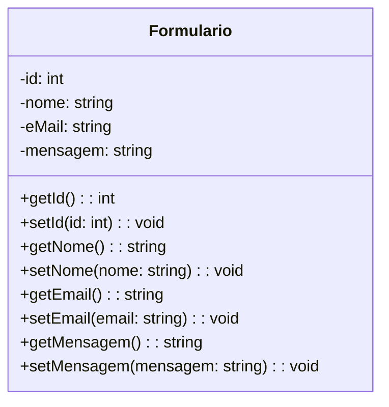

```mermaid
classDiagram
    class Formulario {
        -id: int
        -nome: string
        -eMail: string
        -mensagem: string
        +getId(): int
        +setId(id: int): void
        +getNome(): string
        +setNome(nome: string): void
        +getEmail(): string
        +setEmail(email: string): void
        +getMensagem(): string
        +setMensagem(mensagem: string): void
    }
```
